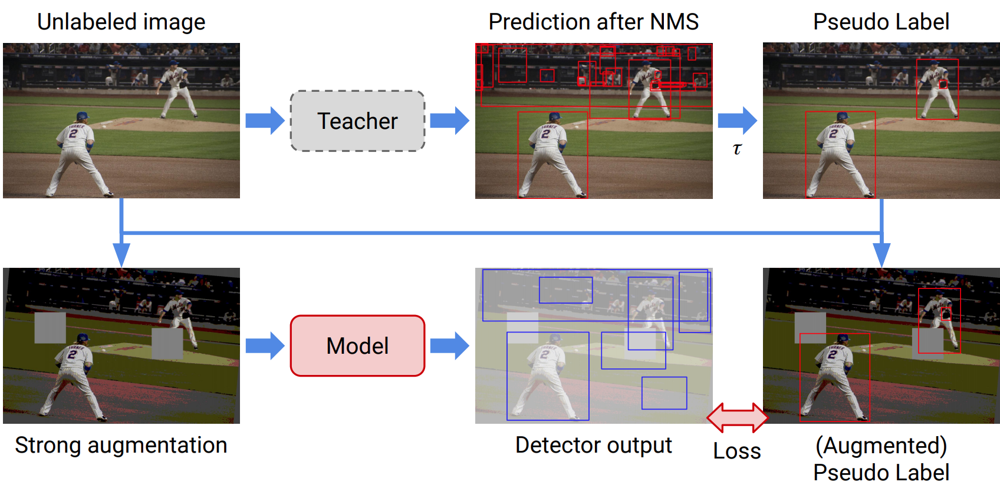

# Source code for STAC: [A Simple Semi-Supervised Learning Framework for Object Detection](https://arxiv.org/pdf/2005.04757.pdf)

STAC is a simple yet effective SSL framework for visual object detection along
with a data augmentation strategy. STAC deploys highly confident pseudo labels of
localized objects from an unlabeled image and updates the model by enforcing
consistency via strong augmentation.



__This code is only used for research. This is not an official Google product.__


# Instruction

## Install dependencies

### Set global enviroment variables.

```bash
export PRJROOT=/path/to/your/project/directory/STAC
export DATAROOT=/path/to/your/dataroot
export COCODIR=$DATAROOT/coco
export VOCDIR=$DATAROOT/voc
export PYTHONPATH=$PYTHONPATH:${PRJROOT}/third_party/FasterRCNN:${PRJROOT}/third_party/auto_augment:${PRJROOT}/third_party/tensorpack
```

### Install virtual environment in the root folder of the project

```bash
cd ${PRJROOT}

sudo apt install python3-dev python3-virtualenv python3-tk imagemagick
virtualenv -p python3 --system-site-packages env3
. env3/bin/activate
pip install -r requirements.txt

# Make sure your tensorflow version is 1.14 not only in virtual environment but also in
# your machine, 1.15 can cause OOM issues.
python -c 'import tensorflow as tf; print(tf.__version__)'

# install coco apis
pip3 install 'git+https://github.com/cocodataset/cocoapi.git#subdirectory=PythonAPI'
```

### (Optional) Install tensorpack

__tensorpack with a compatible version is already included at
third_party/tensorpack.__ `bash cd ${PRJROOT}/third_party pip install --upgrade
git+https://github.com/tensorpack/tensorpack.git`

## Download COCO/PASCAL VOC data and pre-trained models

### Download data

See [DATA.md](DATA.md)

### Download backbone model

```bash
cd ${COCODIR}
wget http://models.tensorpack.com/FasterRCNN/ImageNet-R50-AlignPadding.npz
```

# Training

There are three steps:
- __1.__ Train a standard detector on labeled data
(`detection/scripts/coco/train_stg1.sh`).
- __2.__ Predict pseudo boxes and labels of unlabeled
data using the trained detector (`detection/scripts/coco/eval_stg1.sh`).
- __3.__ Use labeled data and unlabeled data with
pseudo labels to train a STAC detector
(`detection/scripts/coco/train_stg2.sh`).

Besides instruction at here, __`detection/scripts/coco/train_stac.sh`__
provides a combined script to train STAC.

__`detection/scripts/voc/train_stac.sh`__ is a combined script to train STAC on PASCAL VOC.

The following example use labeled data as 10% train2017 and rest 90% train2017 data
as unlabeled data.

## Step 0: Set variables

```bash
cd ${PRJROOT}/detection

# Labeled and Unlabeled datasets
DATASET=coco_train2017.1@10
UNLABELED_DATASET=${DATASET}-unlabeled

# PATH to save trained models
CKPT_PATH=result/${DATASET}

# PATH to save pseudo labels for unlabeled data
PSEUDO_PATH=${CKPT_PATH}/PSEUDO_DATA

# Train with 8 GPUs
export CUDA_VISIBLE_DEVICES=0,1,2,3,4,5,6,7
```

## Step 1: Train FasterRCNN on labeled data

`. scripts/coco/train_stg1.sh`.

Set `TRAIN.AUGTYPE_LAB=strong` to apply strong data augmentation.

```bash
# --simple_path makes train_log/${DATASET}/${EXPNAME} as exact location to save
python3 train_stg1.py \
    --logdir ${CKPT_PATH} --simple_path --config \
    BACKBONE.WEIGHTS=${COCODIR}/ImageNet-R50-AlignPadding.npz \
    DATA.BASEDIR=${COCODIR} \
    DATA.TRAIN="('${DATASET}',)" \
    MODE_MASK=False \
    FRCNN.BATCH_PER_IM=64 \
    PREPROC.TRAIN_SHORT_EDGE_SIZE="[500,800]" \
    TRAIN.EVAL_PERIOD=20 \
    TRAIN.AUGTYPE_LAB='default'
```

## Step 2: Generate pseudo labels of unlabeled data

`. scripts/coco/eval_stg1.sh`.

### Evaluate using COCO metrics and save eval.json

```bash
# Check pseudo path
if [ ! -d ${PSEUDO_PATH} ]; then
    mkdir -p ${PSEUDO_PATH}
fi

# Evaluate the model for sanity check
# model-180000 is the last checkpoint
# save eval.json at $PSEUDO_PATH

python3 predict.py \
    --evaluate ${PSEUDO_PATH}/eval.json \
    --load "${CKPT_PATH}"/model-180000 \
    --config \
    DATA.BASEDIR=${COCODIR} \
    DATA.TRAIN="('${UNLABELED_DATASET}',)"
```

### Generate pseudo labels for unlabeled data

Set `EVAL.PSEUDO_INFERENCE=True` to use original images rather than resized ones for inference.

```bash
# Extract pseudo label
python3 predict.py \
    --predict_unlabeled ${PSEUDO_PATH} \
    --load "${CKPT_PATH}"/model-180000 \
    --config \
    DATA.BASEDIR=${COCODIR} \
    DATA.TRAIN="('${UNLABELED_DATASET}',)" \
    EVAL.PSEUDO_INFERENCE=True
```

## Step 3: Train STAC

`. scripts/coco/train_stg2.sh`.

The dataloader loads pseudo labels from `${PSEUDO_PATH}/pseudo_data.npy`.

Apply `default` augmentation on labeled data and `strong` augmentation on unlabeled data.

`TRAIN.CONFIDENCE` and `TRAIN.WU` are two major parameters of the method.

```bash
python3 train_stg2.py \
    --logdir=${CKPT_PATH}/STAC --simple_path \
    --pseudo_path=${PSEUDO_PATH} \
    --config \
    BACKBONE.WEIGHTS=${COCODIR}/ImageNet-R50-AlignPadding.npz \
    DATA.BASEDIR=${COCODIR} \
    DATA.TRAIN="('${DATASET}',)" \
    DATA.UNLABEL="('${UNLABELED_DATASET}',)" \
    MODE_MASK=False \
    FRCNN.BATCH_PER_IM=64 \
    PREPROC.TRAIN_SHORT_EDGE_SIZE="[500,800]" \
    TRAIN.EVAL_PERIOD=20 \
    TRAIN.AUGTYPE_LAB='default' \
    TRAIN.AUGTYPE='strong' \
    TRAIN.CONFIDENCE=0.9 \
    TRAIN.WU=2
```

## Tensorboard

All training logs and tensorboard info are under
`${PRJROOT}/detection/train_log`. Visualize using
```bash
tensorboard --logdir=${PRJROOT}/detection/train_log
```

# Citation

```
@inproceedings{sohn2020detection,
  title={A Simple Semi-Supervised Learning Framework for Object Detection},
  author={Kihyuk Sohn and Zizhao Zhang and Chun-Liang Li and Han Zhang and Chen-Yu Lee and Tomas Pfister},
  year={2020},
  booktitle={arXiv:2005.04757}
}
```

# Acknowledgement

-   [Tensorpack](https://github.com/tensorpack/tensorpack)
-   [FixMatch](https://github.com/google-research/fixmatch)
-   [RandAugment](https://github.com/tensorflow/tpu/tree/master/models/official/efficientnet)
-   [imgaug](https://github.com/aleju/imgaug)
